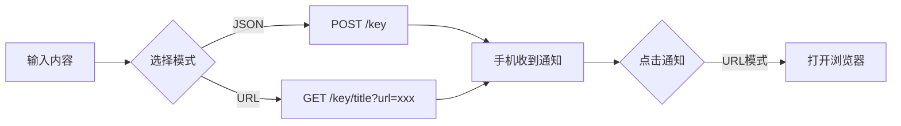

# Bark Push Desktop

基于 [Tauri v2](https://v2.tauri.app/) + Rust 构建的 [Bark](https://github.com/Finb/Bark) 桌面推送客户端。

## 功能

- **快速推送** — 输入内容，一键推送到 iPhone
- **两种发送模式**
  - JSON POST 模式（默认）— 标准 REST API 调用
  - URL GET 模式 — 适合浏览器、curl、脚本等场景，自动添加跳转 URL
- **加密推送** — 支持 AES-128/192/256 + CBC/ECB，KEY 长度自动识别算法，参照 [Bark 加密文档](https://bark.day.app/#/encryption)
- **Token 持久化** — 设备密钥和配置自动保存，重启不丢失
- **系统托盘** — 关闭时最小化到系统托盘，左键恢复窗口，右键显示菜单（显示/退出）
- **剪贴板粘贴** — 一键从剪贴板粘贴内容
- **发送历史** — 最近 5 条记录，点击快速重发
- **发送成功动画** — 按钮变绿反馈
- **调试日志** — 可拖动的浮动日志窗口，支持角标提醒

## 截图



## 快速开始

1. 安装后打开 Bark Push
2. 在「高级选项」中填入你的 Bark 设备密钥
3. 输入推送内容，点击「发送推送」
4. 手机收到通知

## 高级选项

| 选项 | 说明 |
|------|------|
| 设备密钥 | Bark 应用中的设备 Key |
| 服务器 | 默认 `https://api.day.app`，可自建 |
| 铃声 | 通知铃声（birdsong、alarm 等） |
| 加密推送 | 开启后需设置 KEY（16/24/32位）和 IV（16位） |
| 关闭时最小化到任务栏 | 开启后关闭窗口会隐藏到系统托盘 |
| 显示调试日志 | 开启后右下角出现可拖动的日志按钮 |

## 加密使用

参考 [Bark 加密文档](https://bark.day.app/#/encryption)：

```bash
# 示例：AES-256-CBC
KEY=o2nlGxyGV6yq0NvtBe1LbdG4PF6pRFCd  # 32位
IV=69QjZBn2GpTHcmpl                     # 16位
```

在 Bark Push 中开启「加密推送」，填入相同的 KEY 和 IV 即可。

## 下载

从 [Releases](https://github.com/52sanmao/bark-push/releases) 页面下载：

- `Bark Push_1.0.0_x64_en-US.msi` — Windows MSI 安装包
- `Bark Push_1.0.0_x64-setup.exe` — Windows NSIS 安装包

## 开发

### 环境要求

- [Node.js](https://nodejs.org/)
- [Rust](https://rustup.rs/)
- [Tauri CLI](https://v2.tauri.app/start/prerequisites/)

```bash
npm install
npx tauri dev     # 开发模式
npx tauri build   # 构建发布版
```

构建产物在 `src-tauri/target/release/bundle/` 目录下。

## 技术栈

| 层级 | 技术 |
|------|------|
| 前端 | 原生 HTML/CSS/JS |
| 后端 | Rust + Tauri v2 |
| HTTP | reqwest + rustls |
| 加密 | AES-128/192/256 + CBC/ECB (PKCS7) |
| 编码 | base64 + urlencoding |
| 托盘 | Tauri tray API |

## 配置文件

- Windows: `%APPDATA%\bark-push\config.json`

## 许可证

MIT License
